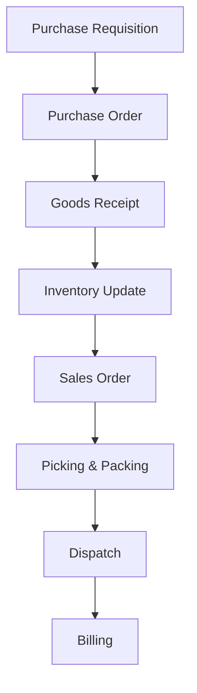

# ERP Business Simulator  
A fully structured ERP workflow simulation replicating enterprise-level processes across Procurement, Inventory, Sales, and Financial flows.  
Designed to demonstrate advanced QA Engineering skills in complex business systems.
---
## 🎯 What This Project Demonstrates
- End-to-end functional testing in multi-module ERP environments  
- Business workflow validation across procurement, sales, inventory, and finance  
- Cross-functional data dependency analysis  
- Risk-based testing methodologies  
- Domain expertise in ERP and supply chain processes  
- System behavior verification under exceptions and edge cases  
- Professional QA documentation and defect investigation practices  
---
## 📦 Modules Included
### 1. Procurement  
- Purchase Requisition  
- Request for Quotation  
- Purchase Order  
- Goods Receipt  
- Supplier invoice logic (simplified)  
### 2. Inventory  
- Stock posting  
- Quantity adjustments  
- Partial receiving handling  
- Movement types simulation  
### 3. Sales  
- Sales Order  
- Picking  
- Packing  
- Shipping  
- Billing (simplified)  
### 4. Finance (Light Simulation)  
- Basic posting rules  
- Ledger consistency checks  
---
## 📸 System Architecture Diagram (Mermaid)

